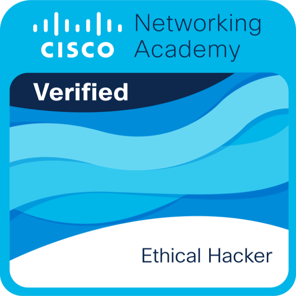
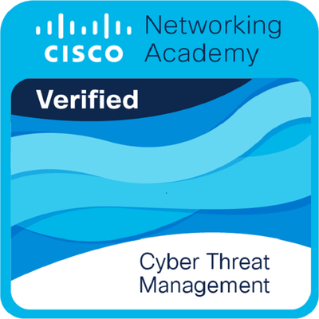
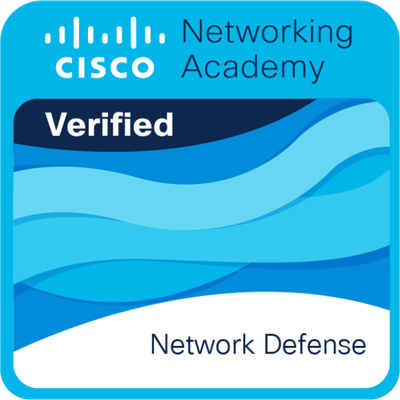

<div align="center">
  <h1 style="border-bottom: none;">Hi, I'm Aditya!</h1>
</div>

```
  Passionate about understanding how things work—transforming nothing into something through curiosity,
  problem-solving, and hands-on exploration in cybersecurity, programming, and emerging tech.
```

## My Skill Set

```

● Penetration Testing (Ethical Hacking) =Burp Suite, Metasploit, Nmap, Wireshark, Hashcat, John the Ripper,
Aircrack-ng, OpenVAS, Nessus, Bloodhound, PowerView, mitm6, Responder

●	Networking & Security Protocols = TCP/IP, DNS, DHCP, VPNs, SSL/TLS, Wi-Fi Security, Packet Sniffing & Analysis

● SIEM = Splunk, Wazuh

●	Digital Forensics = Autopsy, Volatility, FTK Imager, Sleuth Kit, Memory & Disk Forensics

● Reverse Engineering = Ghidra, x64dbg, edb-debugger, Ollydbg, Radare2

●	Hardware Pentesting = SPI, UART, IIC, JTAG, RS232, RS485, SDR (Software Defined Radio)

●	Programming and Scripting = C, Python, Assembly x64 & ARM, Java, Java Script, C++, MySQL

●	Shell Scripting = Bash, PowerShell, EFI V2.2,GRUB

● Operating System = Linux, Windows, Cisco IOS

● Web Vulnerabilities = SQLi, XSS, CSRF, IDOR, SSRF, Auth Bypass

● Active Directory = Kerberoasting, BloodHound, LDAP Enum, Privilege Escalation

● SOC/Pentest = Incident Response, Vulnerability Assessment, MITRE ATT&CK, Log Analysis

● AI/LLM Security = Prompt Injection, Jailbreaking, OWASP LLM Top 10, MITRE ATLAS, RAG Security,
Model/Data Poisoning

```

## ☎️ Contacts

I'm always eager to connect with fellow developers, tech enthusiasts, and collaborators. Feel free to reach out to me through the following channels:

* [](mailto:aditya.ry2007@gmail.com)
* [](https://t.me/The_direct@r)
* [](https://www.linkedin.com/in/aditya-r-yadav/)

---
## 🎖️ Certifications

<p>
  
  
  
</p>

---

## ✨ Code Stats

  <p align = "center">
    
  </p>
  
I like Assembly 👍
